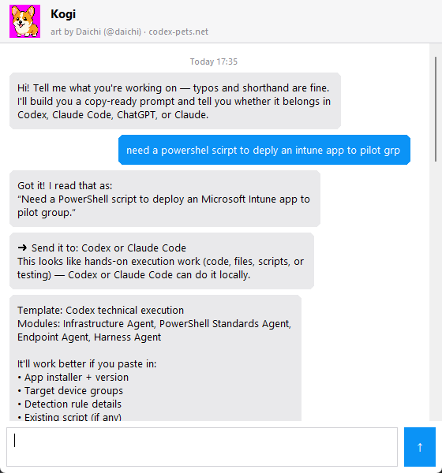

# PromptMate 🐾

A local-only desktop pet that turns messy task descriptions into optimized,
copy-ready prompts for **Codex**, **Claude Code**, **ChatGPT**, or **Claude**.

A pixel pet floats on top of all your windows. Click it, tell it what you're
trying to do — typos, shorthand, and bad grammar welcome — and it replies in
an iMessage-style chat with:

- **Where the prompt belongs** — execution work goes to Codex/Claude Code,
  planning and writing go to ChatGPT/Claude, hybrid work gets both.
- **A recommended prompt template** with task-contract structure (scope,
  inputs, constraints, outputs, verification).
- **Agent modules** — reusable instruction blocks (Infrastructure, Jira,
  Documentation, Validation, Harness, and more).
- **A context checklist** of what to paste in for better results.
- **The finished prompt**, one click to copy.

Everything runs locally: no cloud AI, no accounts, no telemetry. The only
network access is downloading a pet sprite from codex-pets.net when *you*
ask for one.



## What's new

**0.3.0** (2026-06-11)
- Pet resizing: right-click → Pet size → Large / Medium / Small.
- Chat window is fully resizable — bubbles re-flow to the new width.
- Chat UI polish: header bar with pet avatar, name, and artist credit;
  input placeholder; fixed a bug that hid the send button.
- Third content expansion: 33 prompt templates, 26 agent modules, 34 skill
  templates (Graph API, Conditional Access, device policy, Teams/SharePoint,
  bulk CSV ops, vendor cases/evaluations, training guides, ticket replies,
  cert renewal, DNS changes, and more).

**0.2.0** (2026-06-11)
- Desktop pet mode is now the default: the pet floats over all windows,
  wanders, waves, and naps; click it to chat.
- iMessage-style chat with bubbles, typing indicator, and inline
  Copy / Save / Adjust buttons on every generated prompt.
- Pet browser: switch to any of 2,000+ community pets from codex-pets.net
  (right-click → Change pet…), with creator credits.
- Destinations now include Claude and Claude Code alongside Codex and
  ChatGPT web.

**0.1.0** (2026-06-11)
- Initial MVP: prompt templates, agent modules, skill templates, local
  typo/alias correction, intent scoring, prompt history, full editor.

## Install (Windows)

Build the installer yourself (see [Building the Windows
installer](#building-the-windows-installer)), then run
`installer\PromptMate-Setup-<version>.exe`. It installs per-user — no admin
rights — with optional desktop and start-at-sign-in shortcuts, and upgrades
cleanly over a running copy. For silent/enterprise deployment:

```
PromptMate-Setup-0.2.0.exe /VERYSILENT /NORESTART
```

Prebuilt installers are intentionally **not** published on GitHub: the
build bundles the default pet's sprite, which is creator-owned artwork
(see [Pets & artwork credits](#pets--artwork-credits)).

## Quick start (from source)

Requires Python 3.10+ (Tkinter is included in the standard installer). No
packages needed to run the app:

```
python promptmate.py            # pet mode (default)
python promptmate.py --editor   # classic full editor, no pet
```

On first run the pet appears near the bottom-right of your screen:

| Action | Result |
|---|---|
| Left-click the pet | Open/close the chat |
| Drag the pet | Move it (position is remembered) |
| Right-click the pet | Menu: chat, full editor, change pet, credits, wandering, exit |

Type a task in the chat (e.g. `need a powershel scirpt to deply an intune
app pakage to pilot grp`) and press Enter. PromptMate fixes the typos,
expands shorthand (`iac`, `o365`, `aad`…), and replies with the
recommendation and the copy-ready prompt.

## Pets & artwork credits

PromptMate's pets come from [codex-pets.net](https://codex-pets.net), a
gallery of community-made desktop pet sprites. Right-click the pet →
**Change pet…** to browse the catalog (2,000+ pets) and switch.

**The sprites are not included in this repository.** They are artwork by
individual creators with no published license, so PromptMate downloads a
pet only when you select it, caches it in your local user-data folder for
personal use, and shows the creator's name in the pet browser, the chat,
and the **About this pet** menu. Please don't redistribute downloaded
sprites; visit the creator's page on codex-pets.net instead.

Switching pets requires Pillow for image conversion (`pip install Pillow`)
when running from source; the packaged Windows build includes it.

## Spell support (local, no AI)

- Common-typo dictionary and shorthand aliases (`jirra` → Jira,
  `conflunce` → Confluence, `o365` → Microsoft 365)
- Fuzzy suggestions via Python's difflib
- Red underline on unknown words; right-click for suggestions or to add
  words to your personal dictionary
- Accepted corrections are remembered locally

## Where your data lives

| Platform | Location |
|---|---|
| Windows | `%LOCALAPPDATA%\PromptMate\` |
| macOS | `~/Library/Application Support/PromptMate/` |

Settings, prompt history, your custom dictionary, learned corrections, and
downloaded pets. Never inside the install folder; never uploaded anywhere.

## Building the Windows installer

Dev machine needs PyInstaller and [Inno Setup](https://jrsoftware.org/isinfo.php):

```
powershell -ExecutionPolicy Bypass -File build-installer.ps1
```

Produces `installer\PromptMate-Setup-<version>.exe` — per-user install (no
admin), silent-install capable for Intune (`/VERYSILENT /NORESTART`),
upgrades over a running copy and relaunches it. User data survives
upgrades and uninstalls.

## Project layout

```
promptmate.py        the whole app (stdlib-only at runtime)
promptmate-spec.md   product spec
data/                seed libraries exported as JSON (templates, modules, skills)
dictionary/          alias + correction dictionaries (JSON export)
docs/                how-to-use guide
assets/              convert_sprites.py dev tool (sprite art not committed)
test_*.py            smoke tests (logic, editor GUI, pet, pet store, chat visual)
installer.iss        Inno Setup script
build-installer.ps1  one-command build
```

## License

MIT for all code and seed content in this repository (see [LICENSE](LICENSE)).
Pet sprite artwork is **not** covered — each sprite remains the property of
its creator on codex-pets.net.
